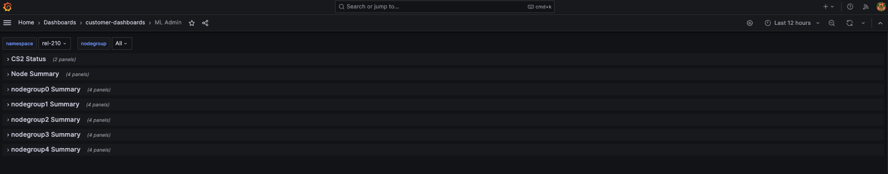

## Overview[#](#overview "Permalink to this headline")

Dive deeper with targeted queries, uncover hidden patterns through interactive exploration, and gain rich context from integrated access to system logs and traces.

Cerebras offers you two Cerebras-tailored Grafana Dashboards:

* **ML Admin dashboard**

    This dashboard is designed to help users and administrators visualize the overall state of the Cerebras Wafer-Scale cluster

* **ML User dashboard**

    This dashboard is specialized for monitoring and managing individual jobs running on the Cerebras Wafer-Scale cluster


## ML Admin Dashboard[#](#ml-admin-dashboard "Permalink to this headline")

The ML Admin dashboard shows the overall state of the cluster. The following figure displays Cerebras’s Wafer-scale ML Admin dashboard:

[](../../images/cluster-monitoring/ml-admin-dashboard.png)

It includes the following:

* **CS-X Status**

    Overall CS-X system status and jobs running on the cluster

* **Node Summary**

    Overall CPU/Memory/Network bandwidth information on different types of nodes

* **Individual NodeGroup Summary**

    Overall CPU/Memory/Network bandwidth information for nodes inside a nodegroup


## ML User Dashboard[#](#ml-user-dashboard "Permalink to this headline")

The ML User Dashboard provides job-level metrics, logs, and traces, allowing users to closely monitor the progress and resource utilization of their specific jobs. The following figure displays Cerebras’s ML User dashboard:

[](../../images/cluster-monitoring/ml-user-dashboard.png)

The following list describes the various panes in the dashboard:

* **Overview**

    Displays the overview of memory/cpu/network bandwidth numbers for all replicas of selected job

* **Server summary by replica type, all nodegroups**

    Displays summary CPU/Memory/Network bandwidth for each replica type in all nodegroups

* **Server summary by replica type, individual nodegroup**

    Displays summary CPU/Memory/Network bandwidth for each replica type in a single nodegroup

* **Replica view**

    Displays memory/cpu/network bandwidth numbers for each `replica_id` of this `replica_type` in each chart. `Replica_type` represents a type of service process for a given job. It can be one of these types: weight, command, activation, broadcastreduce, chief, worker, coordinator. `Replica_id` corresponds to the specific replica for a job and a replica type

* **Assigned nodes**

    Displays physical nodes statuses that are assigned to the chosen `replica_type` and `replica_id`

* **MemX performance**

    Shows iteration-based performance, iteration time, cross-iteration time, and backward iteration time


There are various filters users can select:

* **wsjob**

    Indicates the ID of the weight-streaming run, which is used to select between different runs on a particular system

* **replica_type**

    Allows selecting between the activation, weight, and all server metrics

* **nodegroup**

    Selects a nodegroup to show server summaries


Other fields available that are useful are the model, job\_type, and the replica\_id.

## Prerequisites[#](#prerequisites "Permalink to this headline")

You have access to the user node in the Cerebras Wafer-Scale cluster. Contact Cerebras Support for any system configuration issues.

You can run a port-forwarding SSH session through the user node from your machine with this command:

```Bash
$ ssh -L 8443:grafana.<cluster-name>.<domain>.com:443 myUser@usernode
```
<Info>
Note

This command uses the local port `8443` to forward the traffic. You can choose any unoccupied port on your machine.
</Info>
## How to get access?[#](#how-to-get-access "Permalink to this headline")


Links are accessible from the **General/Cerebras** tab. The following figure displays a Cerebras dashboard:

[](../../images/cluster-monitoring/dashboards-intro.png)

### Steps to get access[#](#steps-to-get-access "Permalink to this headline")

**1.** Ask your system administrator to set up the Grafana database. URLs come in the format: `grafana.CLUSTER-NAME.DOMAIN.com` For example: grafana.mb-systemf102.cerebras.com

**2.** Get authentication credentials for Grafana (username and password) from your system administrator.

**3.** Add the Grafana TLS certificate to your browser keychain. The Grafana TLS certificate is located at `/opt/cerebras/certs/grafana_tls.crt` on the user node. This certificate is copied during user node installation process. Download this certificate to your local machine and add this certificate to your browser keychain.

> **On a Chrome browser on Mac OS:**
>
> 1.  Go to **Preferences -> Privacy and Security -> Security -> Manage Certificates**
>
> 2.  Add `grafana-tls.crt` into **System** keychain certificates. Make sure to set **Always Trust** when using this certificate
>
> 3.  Next, edit your local machine’s `/etc/hosts` file to point the IP of the user node to Grafana: &lt;USERNODE_IP&gt; grafana.&lt;cluster-name&gt;.&lt;domain&gt;.com
>
> 4.  Finally, navigate in your browser to the URL `https://grafana.<cluster-name>.<domain>.com` to access the Grafana Dashboards
>

## Viewing performance metrics using the ML User dashboard[#](#viewing-performance-metrics-using-the-ml-user-dashboard "Permalink to this headline")

You can view cluster iteration-performance metrics by tracking update times across the weight servers.

Our current dashboard implementation shows iteration time, forward-iteration time, backward-iteration time, cross-iteration time, and input starvation.

* **Iteration time**

    Indicates the time from the end of iteration “i-1” on the weight servers to the end of iteration “i” on the weight servers.

* **Forward-iteration time**

    Indicates the time spent in iteration “i” during the forward pass.

* **Backward-iteration time**

    Indicates the time spent in iteration “i” during the backward pass.

* **Cross-iteration time**

    Indicates the time between the last gradient received of an iteration to the first weight sent. A high value indicates an optimizer performance bottleneck.

* **Input starvation**

    Indicates the time spent waiting on the framework to receive activations.


These statistics are shown in the following image and can be used to identify performance bottlenecks in the training process:

[](../../images/cluster-monitoring/perf_dashboard_perf.png)

## Viewing utilization metrics using the ML User Dashboard[#](#viewing-utilization-metrics-using-the-ml-user-dashboard "Permalink to this headline")

The following figure shows the overview status for a job, including the list of CS-X, start and end time, memory/cpu/network usage for different replicas in a job:

[](../../images/cluster-monitoring/ml-user-overview.png)

The **Overview**, **Server summary by replica, all nodegroups**, and **Server summary by replica, individual nodegroup** display memory/cpu/network bandwidth numbers relevant to a job, with different granularity levels. The **Overview** show the metrics for all replicas in a job, and systems are used by the job. The two **Server summary by replica** panes show the metrics in all nodegroups, or an individual nodegroup.

The **Replica view** metric displays memory/cpu/network bandwidth numbers for each `replica_id` of this `replica_type` in each chart. `Replica_type` represents a type of service process for a given job. It can be one of these types: weight, command, activation, broadcastreduce, chief, worker, and coordinator.

**1.** **Egress bandwidth** indicates each supporting server’s maximum and mean network egress speeds. This might be helpful information to monitor whether jobs are network-bound via the transmission speeds of a lagging node.

> The following figure shows that weight servers achieve a maximum network transmit speed of ~33 MB/s:

[](../../images/cluster-monitoring/ml-user-egress.png)

**2.** **Ingress bandwidth** denotes the ingress speeds for each supporting server. For example, in this instance, the weight servers have an average ingress speed of around 20 MB/s.

The following figure shows the **ingress bandwidth** metric:

[](../../images/cluster-monitoring/ml-user-ingress.png)

**3.** **CPU usage** shows the CPU percentage utilization for each weight-server. In this case, the CPUs are only 5-7% utilized.

The following figure shows the **cpu usage** metric:

[](../../images/cluster-monitoring/ml-user-cpu.png)

**4.** **Memory usage** indicates the maximum and mean amounts of memory each weight server uses over time. This can be useful in debugging whether the weight servers are memory-bound. For more information on memory requirements, visit resource\_parallel\_compile.

The following figure shows the **memory usage** metric:

[](../../images/cluster-monitoring/ml-user-memory.png)

**5.** You can use the Grafana interface to show individual metrics for a particular node that runs a replica. For example, these are the views for CPU and memory usage for the node that runs **weight-2** replica:

The following figure shows the **cpu usage per node** metric:

[](../../images/cluster-monitoring/ml-user-per-node-cpu.png)

The following figure shows the **memory usage per node** metric:

[](../../images/cluster-monitoring/ml-user-per-node-memory.png)
