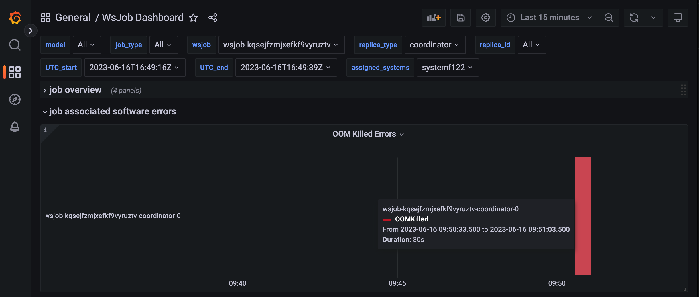

This section covers tips and tricks to identify when the resources needed are larger than the resources available.

## Determining if your job is queued[#](#determining-if-your-job-is-queued "Permalink to this headline")

If multiple users are submitting jobs to the cluster, the cluster will queue jobs which lack available capacity to execute. From a user perspective, your python client code will log messages similar to the following.

```
INFO:   Poll ingress status: Waiting for job running, current job status: Queueing, msg: job queueing, waiting for lock grant. Cluster status: 3 execute job(s) queued before current job, systems in use: 1
INFO:   Poll ingress status: Waiting for job running, current job status: Queueing, msg: job queueing, waiting for lock grant. Cluster status: 2 execute job(s) queued before current job, systems in use: 1
```

You can inspect the state of the Running jobs in the cluster by running the [csctl tool](../Cluster-monitoring/csctl.html#csctl) from the usernode:

```bash
$ csctl get jobs
NAME                          AGE    DURATION  PHASE      SYSTEMS                USER
wsjob-kupuv2wlsvuzxc4qnbhrhu  7h14m  3m25s     RUNNING    systemf130             lab
wsjob-vehs7tjbjjaw8dpxiedypq  7h19m  4m32s     RUNNING                           lab
```

## Determining if job failed because of an OOM error[#](#determining-if-job-failed-because-of-an-oom-error "Permalink to this headline")

If your job fails with an out of memory (OOM) error, the client will receive a list of events in its log stream containing messages similar to the following:

```
reason: "OOMKilled"
message: "Pod: job-operator.wsjob-kqsejfzmjxefkf9vyruztv-coordinator-0 exited with code 137 The pod was killed due to an out of memory (OOM) condition where the current memory limit is 32Gi."
```

Additionally, grafana will show an OOM event in the [wsjob dashboard](../Cluster-monitoring/grafana.html#job-dashboard).

[](../../images/troubleshooting/OOM_error_grafana.png)

Fig. 15 OOM software error in the wsjob dashboard[#](#id1 "Permalink to this image")

## Determining if job failed because of system could not fit requested memory[#](#determining-if-job-failed-because-of-system-could-not-fit-requested-memory "Permalink to this headline")

Jobs which request resources like memory or number of CS systems which is beyond the capacity of the cluster will immediately fail with a scheduling error similar to the following:

```
reason=SchedulingFailed object=wsjob-cd2ghxfqh7ksoev79rxpvs message='cluster lacks requested capacity: requested 1 node[role:management]{cpu:32, mem:200Gi} but 1 exists with insufficient capacity {cpu:64, mem:128Gi}
```

## Troubleshooting OOM errors[#](#troubleshooting-oom-errors "Permalink to this headline")

If your job fails because of an OOM error and the component which OOM’d is coordinator, you can try increasing the amount of memory using the runconfig` section of the `yaml` configuration file as in the example below:

```bash
runconfig:
  compile_crd_memory_gi: 100
  execute_crd_memory_gi: 120
  wrk_memory_gi: 120

```
Additionally, you can schedule a job without limits by setting the memory to -1.

```bash
runconfig:
  compile_crd_memory_gi: -1
```
and observe the maximum memory usage in Grafana. This method should be used with caution since it can affect other users in the system whose jobs may be running on the same node as the Pod which is now running without limits and can effectively use the entire system’s memory.
